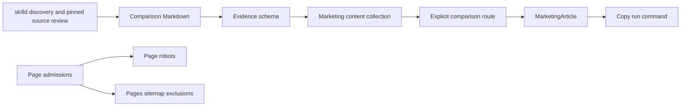

# Comparison architecture

A comparison explains which Skill fits a concrete task.
[ADR-0009](../adr/0009-editorial-skill-comparisons.md) records the pillar decision.

## Ownership and topology

| Concern | Owner |
| --- | --- |
| Article and source ledger | `layers/marketing/content/comparisons/<slug>.md` |
| Required evidence parser | `layers/marketing/shared/comparison.ts` |
| Collection schema | `layers/marketing/content.config.ts` |
| Route | `layers/marketing/app/pages/compare/<slug>.vue` |
| Renderer and metadata | Existing `MarketingArticle` and `useMarketingArticle` |
| Indexing and cull | `page-admissions.ts` and discovered comparison routes in `nuxt.config.ts` |

No live registry join is needed to render an article.
If future articles need registry data, read it over HTTP.
Keep prose, evidence, and selection reasons in the article, outside registry rows.

## Authoring contract

1. Name one reader decision and one target query. State the inclusion and exclusion rules.
2. Discover candidates through `skilld search <query> --json`. Use returned selectors without guessing.
3. Read each candidate with `skilld run <selector> --json` and named supporting files when needed.
4. Record the exact source commit and SKILL.md link. Preserve failures and private research in scratch.
5. If delivery fails, inspect pinned public source independently. Describe the method without claiming a successful run.
6. If checks block delivery, keep that constraint beside the candidate. Do not suggest bypassing checks.
7. Write the decision table, meaningful tradeoffs, and conditional recommendations before background material.
8. Review material claims against the sources, then review voice against COPY and GLOSSARY.

Frontmatter requires `targetQuery`, `reviewedAt`, `reviewDueAt`, `scope`, `methodology`, `disclosure`, and `sources`.
Each source records `selector`, `revision`, and `url`. The URL names the same repository and commit.
Use `methodology: source-review`. Do not infer output quality from instruction length, stars, or rule counts.

Visible content carries the review date, selection scope, method, limitations, and relevant relationships.
Use agent authorship for agent-written work. Never attribute the article to Harlan without approval.
Source links remain one click away. Link the writing track for broader discovery.
Wrap each table in a focusable `.comparison-table` region with a specific accessible label.
Keep horizontal scrolling inside that region. Preserve native table semantics.

## Comparison conventions

Lead with conditional choices. Compare the same decision dimensions across candidates.
Describe partial or unknown coverage in words. Avoid decorative checkmarks and a universal winner.
Include disadvantages for a preferred candidate. Separate related forks from independent evidence.
Distinguish source declarations, observed behavior, and editorial opinion.

Keep factual meaning, conditions, citations, and deliberate voice as common evaluation criteria.
Do not equate a Skill's internal score with detector accuracy or benchmark performance.
No detector-evasion promise, invented testimonial, fabricated result, paid placement, or safety claim.
Do not add Product, Review, or rating schema without evidence that supports those entities and properties.

These conventions adapt the [alternatives-pages Skill](https://github.com/jonathimer/devmarketing-skills/blob/500b44b53220292879223a807ce0d349aafe2537/skills/alternatives-pages/SKILL.md).
It was discovered and read through skilld with verified provenance.
Its default commercial CTA and keep-every-page advice yield to VISION's run action and cull rule.
[Google's reviews guidance](https://developers.google.com/search/docs/appearance/reviews-system) favors original research and analysis.
[Google's helpful-content guidance](https://developers.google.com/search/docs/fundamentals/creating-helpful-content) asks authors to explain how content was produced.
These are quality principles, not a promise of ranking.

## Admission, refresh, and cull

Default every new comparison to noindex. Add no admission based on estimated demand.
To admit it, record measured demand or its named experiment role in `PAGE_ADMISSIONS`.
Use the existing bar in that file, plus the editorial contract above.
The initial query is `humanize writing skills comparison`. No volume measurement is claimed.

Review sources at least quarterly, and sooner after a material source change or correction.
Update `reviewedAt` only after reading the relevant sources again.
Set `reviewDueAt` to the next editorial review date. It creates no automation or promise of a scheduled task.
Refresh affected claims, source commits, language support, required files, and command availability together.

If an admitted article loses its evidence or task value, remove its admission first.
If the article is retired, remove the route and content. Redirect only when a real equivalent exists; otherwise return 410.
Do not leave obsolete comparison matrices indexed for URL volume.

## Verification

Check schema rejection paths, robots, sitemap exclusion, and missing-content 404.
Check SSR content, canonical URL, and the copied command in the running page.
Check table overflow at 375px and 768px, keyboard access, and both themes.
Run the repository checks and published CLI grammar check before submitting the PR.
