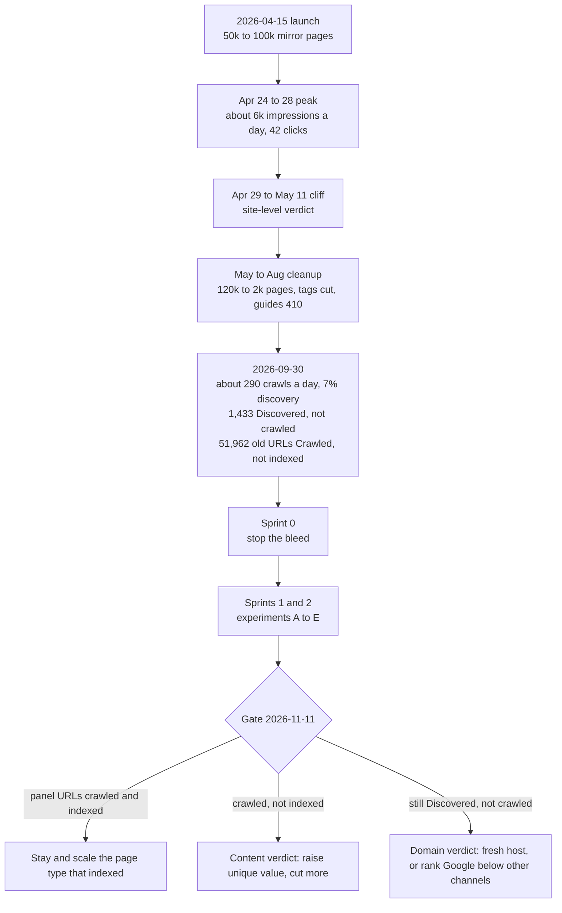

# SEO recovery

Status: open · 2026-10-03 · recovery implementation included in deployed `1ccf98ec`; gate 2026-11-11

**Next move:** Ready. Verify panel loading and sitemap submission evidence. Harlan submits any missing sitemaps. Run the first weekly measurement on 2026-10-12.

Done means: the gate table below has a decision for 2026-11-11, and every panel URL in [seo-recovery-panel.json](seo-recovery-panel.json) has a coverage state read on that date.

This brief supersedes the measurement plan in [EXECUTE-seo-keyword-rework.md](EXECUTE-seo-keyword-rework.md). It does not supersede that brief's surface list.

## Ledger

- [x] Sprint 0 implementation and the fixed panel included in deployed `1ccf98ec`
- [ ] Verify Bing submission of `sitemap_index.xml` and Search Console submission of `retired.xml`
- [ ] Load the panel with `gscdump indexing watch add`
- [ ] Add a `b_linked` group of 10 Skill URLs to the panel before experiment B starts
- [ ] Add a NuxtSEO annotation on the day gscdump.com #557 goes live
- [ ] Weekly measurements 1 to 5 logged in the Log below, from 2026-10-12 to 2026-11-09
- [ ] Experiment A read
- [ ] Experiment B read
- [ ] Experiment D read
- [ ] Experiment E read
- [ ] Experiment F read, including coverage and relevant query impressions for the writing comparison
- [ ] Gate decision recorded on 2026-11-11
- [ ] Move this brief to `shipped/` once the gate decision is recorded

## Log

- 2026-10-08 The quality gate excludes `browser-use/plugins/browser-use` from the active recovery baseline.
  Production D1 retained its month-board admission from 2026-09-30, but recorded `seo_indexable=0` and `no_primary_trust_signal`.
  Its score record was 4, dated 2026-10-06 03:00:35 UTC. The source resolved and the Repository was healthy.
  Curator reasons, approved social posts, owner verification, and trust overrides were absent.
  The official Repository list names `browser-use/browser-use`, not `browser-use/plugins`.
  GitHub returned [the source](https://github.com/browser-use/plugins/blob/main/grok/skills/browser-use/SKILL.md) at D1's blob SHA, `0acbe30cb641795319aab5b3885dc0415266b375`.
  HTML returned noindex with a self-canonical URL. The Skills sitemap omitted it.
  [The quality rule](../../layers/registry/server/utils/skill-indexability.ts) requires a primary trust signal.
  [Trending admission](../../layers/registry/server/utils/trending-admission.ts) preserves admission, but does not waive that rule.
  Move the URL to `quality_excluded`; keep all 41 original URLs and the dated baseline evidence.
  The active trending sample has 19 URLs. No replacement receives the excluded URL's history.
  These reads do not establish when the URL first became noindex.

- 2026-10-05 Harlan approved experiment F for `/compare/humanize-writing-skills` at the existing 11 November gate.
  One comparison joins the panel, taking it from 40 to 41 URLs. Existing groups remain unchanged.
  The target query estimate is 30 US searches per month. This is a named experiment exception to the volume bar.
  Harlan also requested author credit. The article retains its agent research and drafting disclosure.

- 2026-10-03 Deployment [37038090688](https://github.com/skilld-dev/skilld.dev/actions/runs/37038090688) passed on `1ccf98ec`.
  Its history includes Sprint 0, #325, #332, #333, and #334. No fresh crawl or indexing results were read.
  Panel loading, sitemap submissions, and the cross-repository gscdump release sequence need separate evidence.
  Drafts #318, #320, and #321 remain deferred under the October 1 decisions.

- 2026-09-30 Brief written from the 2026-09-30 NuxtSEO and Search Console reads. Panel of 40 URLs fixed.
- 2026-10-01 Owner deferred experiment C. Template changes wait. #318 stays in draft. The panel keeps 40 URLs; the C groups became one `trending_sample` of 20.
- 2026-09-30 Two panel Skills left the index after #322 admitted only trending Skills: `onmax/nuxt-skills/arkenv` and `pbakaus/agent-reviews/resolve-agent-reviews` were on no board. `ferdinandobons/startup-skill/startup-pitch` and `browser-use/plugins/browser-use` replace them in the trending sample. `dpearson2699/swift-ios-skills/swift-concurrency` takes the place of the second one in `admitted_other`.

## Diagnosis

Google gave the site a sitewide quality verdict. The site has no trust signals to recover with.

- The pattern is a honeymoon, then a site-level demotion. This is not classic "new site jail". A jailed site never gets past the homepage.
- skilld was indexed and ranking within 10 days of the 2026-04-15 launch. It reached about 6k impressions a day, position about 8, and 42 clicks on 2026-04-28.
- The cliff started on 2026-04-29. The March core update ended on 2026-04-08. The May core update started on 2026-05-21. So a continuously running system caused it, not a named update.
- The cliff came before skilld's own cuts on 2026-05-04 and 2026-05-08. Google moved first.
- Search Console over-counted impressions until 2026-04-27, so the peak may be inflated. Clicks fell from 42 to about 1 at the same time. The drop is real.
- About 50k pages copied from GitHub went live in April. 72% of the main text on a Skill page is the GitHub SKILL.md, word for word (sample: `anthropics/skills/frontend-design`).
- The site has almost no links, no brand searches, and no referral traffic. Nothing prompts Google to look again.
- The current curated set is "Discovered, currently not indexed". Google queued it but never crawled it. So the limit is demand, not content.
- The 51,962 old April URLs are "Crawled, currently not indexed". Google read them, rejected them, and still holds them.
- Cleanup alone fixes the first cause at best. No case in the outside research recovered from cleanup alone within 6 months on the same domain.
- Moving the same content to a fresh host would likely carry the verdict with it. A new host helps only with pages that are different and better.

## Evidence

All values are dated 2026-09-30 unless stated. Sources: NuxtSEO CLI, the Search Console UI, and the site's own checks.

| Signal | Value | Source |
| --- | --- | --- |
| Clicks, 6 months | 178. The last click was 2026-07-26 | NuxtSEO search analytics |
| Impressions, late September | 0 to 5 per day | NuxtSEO search analytics |
| Retained URL Inspection | 1 indexed (the homepage) of 1,487. 1,484 read "URL is unknown to Google". The capture time is null | NuxtSEO indexing summary |
| Homepage last crawl | 2026-08-30 | NuxtSEO indexing urls |
| Sitemap | `skills-0.xml` submitted 2026-08-22, last read 2026-09-22, 1,389 URLs discovered | Search Console sitemaps |
| Brand query `skilld` | 44 impressions in 6 months, average position 20.6 | NuxtSEO keywords |
| Backlinks | 36 referring domains. 20 come from 2 spam networks. 16 are clean | NuxtSEO backlinks summary |
| Referral sessions, 28 days | GitHub 10, Bing 20 | NuxtSEO source and medium |

The retained URL Inspection is stale. 1,231 of its verdicts date from 2026-08-20 to 2026-08-22. "Unknown" URLs back off from 7 to 120 days between re-checks. Trust the Pages report below instead.

### Pages report, "Why pages aren't indexed"

| Reason | Pages | Validation | Read |
| --- | ---: | --- | --- |
| Crawled, currently not indexed | 51,962 | Failed | The old April URLs. Google holds them |
| Excluded by noindex | 16,639 | Failed | Retired or non-curated pages. Works as intended |
| Soft 404 | 2,621 | Started | Made-up `/gh/...` URLs returned HTTP 200 with a thin noindex page. #317 fixes the cause |
| **Discovered, currently not indexed** | **1,433** | Not started | **The current curated set** |
| Not found (404) | 398 | Not started | Fine |
| Alternate page with proper canonical | 5 | Failed | Fine |
| Duplicate, Google chose a different canonical | 2 | Started | Fine |

- Do not click "Validate fix" on "Crawled, currently not indexed". It already failed and proves nothing.
- Google's view is about 52k rejected URLs against 1.4k current ones. At about 29 HTML crawls a day, clearing that history takes a long time. Experiment E targets it.

### Crawl stats, 90 days to about 2026-09-28

| Signal | Value | Read |
| --- | --- | --- |
| Total requests | 26.3k, about 290 per day | Google still visits |
| By file type | JavaScript 58%, other 16%, HTML 10%, CSS 2%, image 2% | About 29 HTML pages per day |
| By Googlebot type | Page resource load 73%, smartphone 19%, image 8% | Most of the crawl renders |
| By purpose | Refresh 93%, discovery 7% | Google barely explores |
| By response | 200: 78%. 301: 9%. 404: 7%. Other 4xx (410): 5%. DNS error: under 1% | 21% goes to dead or moved URLs |
| Average response time | 392 ms | HTML alone is slower |
| Hosts | `skilld.dev` 26,189 requests, `www.skilld.dev` 68 | `www` has no DNS record |

Site checks on 2026-09-30:

- A Skill page references 82 JS files. 64 of them are modulepreload.
- The site had about 17 or more successful deploys in 30 days. Each deploy changes chunk hashes, so Google fetches the JS again. That explains the 58% JS share.
- Skill page HTML has `cache-control: private, no-store` and `cf-cache-status: BYPASS`. Time to first byte is 0.2 s to 0.4 s warm and 1 s to 2.7 s cold.

What this means:

- Crawl demand limits the site, not crawl capacity. Google says crawl budget rarely matters under 10k URLs.
- Crawl waste is still cheap to cut: dead URLs (21%), JS churn, and the `www` DNS errors.
- Discovery share is the fastest feedback signal. It moves before indexing does.

### Outside evidence

Google statements:

- Mueller and Splitt, 2026-07-16: with strong quality doubts, Google crawls and indexes less. That matches the 1,433 Discovered URLs.
- Mueller, 2026-09-07: Google "possibly lost faith" in a site because of its old pages. Deleting them is "a starting point". Filler added to generated pages does not help.
- Recovery takes "several months", with no maximum. After a few quiet months, the wait often ends at a core update.
- 404, 410 and noindex count the same.
- Mueller, 2025-11-28: a new domain can be faster than repairing a bad one. Moving the same content to it tends to carry the problem across.
- AI Overviews and AI Mode cite only pages in Google's index. They give no way around the verdict.

Updates: the September 2026 spam update started rolling out on 2026-09-24. It may run until about 2026-10-08. Read no results until it ends. No core update has been announced since 2026-06-02.

Observed cases:

- Spam-style recovery: 5 months at the fast end.
- Helpful-content-style suppression: 12 to 24 months. After 11 months, only 22% of sites had partly recovered (Glenn Gabe).
- Aggregators lost ground in the 2026 core updates. First-party sources gained.
- Request indexing and the Indexing API were tried 6 times in 43 reports. Neither worked alone.
- GetInvoice cut 22k AI pages. After 6 months with no recovery, it restarted on a new domain. That worked.
- Weird Gloop found about 90% of new-domain wikis stuck with only the homepage indexed. That is the same shape as skilld. A subdomain of an established host indexed within about 1 week. Escapes followed demand spikes and steady links from Steam news posts.

### Drift since the cleanup

- The skills table grew from about 2.1k to 14.8k rows.
- An estimated 3k to 5k Skill pages are `index,follow` but missing from the sitemap.
- About 15 new indexable marketing pages went live on 2026-09-04 (`/agents/*`, `/vs/*`).
- Eight tag pages and five retired collections stayed indexable.
- IndexNow was off from 2026-07-26 after 8 days of HTTP 429 errors.
- The 2026-09-10 measurement in [EXECUTE-seo-keyword-rework.md](EXECUTE-seo-keyword-rework.md) never ran.

Competitors rank for our queries: skills.sh, skillsdirectory.com, agenticskills.io, and openagentskill.com. The niche is open. Every Skill-specific competitor gets 5.2k organic visits a month or less. The three trends measured fell 22% to 29%.

## Sprint 0, 2026-10-01 to 2026-10-07: stop the bleed

Check each PR with `gh pr view <n> --repo skilld-dev/skilld.dev`.

| # | Item | PR |
| --- | --- | --- |
| 1 | The sitemap equals the indexable set: trending boards (week, month, all) plus 2 probe pages. 65 Skills at the start. The set only grows after the gate. humanizer, taste-skill and visual-explainer are in. ui-ux-pro-max, caveman, ponytail and stop-slop are out | [#322](https://github.com/skilld-dev/skilld.dev/pull/322) |
| 2 | Freeze and marketing page audit. Bar: 100 searches a month. `/agents/codex`, `/agents/cursor`, `/agents/claude-code` and `/vs/context7` stay indexable. The rest are noindex | [#322](https://github.com/skilld-dev/skilld.dev/pull/322) |
| 3 | Hygiene: tag chip links, noindex URLs out of sitemaps, related lists skip gone Skills, 8 tag pages noindex; 5 stale collections retired | [#322](https://github.com/skilld-dev/skilld.dev/pull/322), [#326](https://github.com/skilld-dev/skilld.dev/pull/326) |
| 4 | No zone rate limit on `/gh/*` exists, so nothing to exempt. 60 parallel requests to one `/gh/` page all returned 200 on 2026-09-30 | [#324](https://github.com/skilld-dev/skilld.dev/pull/324) |
| 5 | Crawl waste: `www` 301; 75 to 19 JS preloads; HTML edge cache | [#316](https://github.com/skilld-dev/skilld.dev/pull/316), [#323](https://github.com/skilld-dev/skilld.dev/pull/323), [#328](https://github.com/skilld-dev/skilld.dev/pull/328), [#329](https://github.com/skilld-dev/skilld.dev/pull/329) |
| 6 | Real 404 and 410 for missing Skills; 503 with `Retry-After` when the lookup fails | [#317](https://github.com/skilld-dev/skilld.dev/pull/317) |
| 7 | Recovery URL panel | [seo-recovery-panel.json](seo-recovery-panel.json) |
| 8 | Author profiles, collections, owner hubs and multi-Skill repository hubs render `noindex,follow`. The `authors` and `sources` sitemaps are gone (owner decision, 2026-10-01). A single-Skill repository hub is the Skill's page and stays in the skills sitemap when the trending admission rule admits it | this change |

Checks:

- `curl -sI https://www.skilld.dev/` shows the `www` redirect.
- `curl -sI https://skilld.dev/gh/harlan-zw/gscdump | rg -i 'cache-control|cf-cache-status'` shows the HTML cache headers.
- `curl -s -o /dev/null -w '%{http_code}\n' https://skilld.dev/gh/nobody/nothing/nothing` shows the missing Skill status.

Historical merge order, recorded before the October 3 check-in:

Check a PR with `gh pr view <n> --repo skilld-dev/skilld.dev`.

1. [#332](https://github.com/skilld-dev/skilld.dev/pull/332), the `return_to` fix, merged before deployed `1ccf98ec`.
2. [#334](https://github.com/skilld-dev/skilld.dev/pull/334), the edge cache check, merged before deployed `1ccf98ec`.
3. [#331](https://github.com/skilld-dev/skilld.dev/pull/331), this brief, and [#333](https://github.com/skilld-dev/skilld.dev/pull/333), the Monday check-in, merged before deployed `1ccf98ec`.
4. Keep in draft, do not merge:
   - [#318](https://github.com/skilld-dev/skilld.dev/pull/318), experiment C, deferred on 2026-10-01.
   - [#320](https://github.com/skilld-dev/skilld.dev/pull/320), IndexNow. On 2026-10-01 the owner moved IndexNow submission to another service.
   - [#321](https://github.com/skilld-dev/skilld.dev/pull/321), which shows the badge block only on indexable hubs. A badge on a noindex page still brings people to the site, so the gate is not needed (owner, 2026-10-01).

gscdump family:

1. [gscdump #147](https://github.com/harlan-zw/gscdump/pull/147) (trend analyzer), then [gscdump #148](https://github.com/harlan-zw/gscdump/pull/148) (coverage states, capture, Watched URLs).
2. Release `@gscdump/*` 4.6.0. Version 4.5.0 did not include #147 and #148.
3. Refresh the gscdump.com lockfile to 4.6.0. Run fleet migrations 0013 and 0014 as the gscdump.com runbook says.
4. [gscdump.com #557](https://github.com/harlan-zw/gscdump.com/pull/557), then [#556](https://github.com/harlan-zw/gscdump.com/pull/556).
5. [nuxtseo.com #1312](https://github.com/harlan-zw/nuxtseo.com/pull/1312) dates the indexing summary from the gscdump capture time. When nuxtseo moves off gscdump 3.8.0, add `not_indexed` to every exhaustive `HealthStage` map.

After #557 is live, the counts behind each coverage bucket change meaning. Triage gains a `not_indexed` stage. Trend charts show a step on that day. Add a NuxtSEO annotation.

## The panel

[seo-recovery-panel.json](seo-recovery-panel.json) defines the measurement groups and their URLs.

| Group | URLs | Treatment | Expect |
| --- | ---: | --- | --- |
| `trending_sample` | 19 | None. No template change | Baseline for admitted trending pages |
| `quality_excluded` | 1 | Quality gate excludes the page | Observe coverage separately; omit from active recovery decisions |
| `d_probe` | 2 | One linked page and one unlinked page (experiment D) | The linked page is crawled within 14 days; the unlinked page is the comparison |
| `demand` | 3 | High search demand, in the trending set | First to earn impressions if indexed |
| `admitted_other` | 10 | Trending set only | Trending-only baseline |
| `retired` | 5 | Retired URLs in the retired sitemap (experiment E) | Move out of "Crawled, currently not indexed" |
| `f_comparison` | 1 | Original source comparison with contextual internal links | Indexed with impressions for relevant prose editing or comparison queries |
| `b_linked` | 10, to fill | Outside links from README badges (experiment B) | Crawled or indexed within 14 days of the link |

The `b_linked` group is not in the panel yet. Its 10 URLs are the Skill pages that receive outside links. When the first badge links land, pick them from the top 50 Skills whose maintainers got a badge request. Then move `b_linked` from `pending_groups` to `groups` in the JSON.

Baseline: the Pages report of 2026-09-30. The curated URLs sit in "Discovered, currently not indexed". The retired URLs sit in "Crawled, currently not indexed". The first per-URL reading comes from gscdump Watched URLs, after gscdump 4.6.0 and gscdump.com #557 are live. Load the panel with `gscdump indexing watch add`. Add at most 50 URLs per call.

## Weekly measurement

Every Monday from 2026-10-12, about 10 minutes. The first read waits for the spam update to end. Log one line per week in the Log above.

1. Read each panel URL's coverage state with `nuxtseo search indexing urls` or `nuxtseo search inspect`. Record the rung: unknown, discovered, crawled, indexed.
   Report `quality_excluded` separately. Exclude it from active recovery totals and experiment scale or kill decisions.
   Recheck its quality eligibility each week. If eligibility changes, record the date before changing its group.
   Keep its earlier observations in their original group. Never treat an intentional noindex as failed recovery.
2. Read Search Console crawl stats in the UI. This is the leading signal.

   | Signal | Baseline |
   | --- | --- |
   | Discovery share | 7% |
   | HTML share | 10% |
   | Share of 404, 410 and 301 responses | 21% |

3. Read impressions and clicks over 7 days, and impressions for the brand query `skilld`.
4. Read clean referring domains (`nuxtseo backlinks referring-domains`) and GitHub and Bing referral sessions.
5. Read the Pages report totals: "Crawled, currently not indexed" (baseline 51,962) and "Discovered, currently not indexed" (baseline 1,433).

Read no result before the September 2026 spam update ends, about 2026-10-08. The first read is 2026-10-12.

## Experiments, 2026-10-08 to 2026-11-04

Each experiment makes one demand signal. Each has a scale rule. If the scale rule fails by its read date, stop the experiment and log the result. Keep its surface only if it serves Loop 1.

### Trending-only indexable set

Sprint 0 item 1 is the base for every experiment. Only Skills admitted from the trending boards, and the named exceptions, are indexable. Stop adding pages until the gate. This limits the site to one clear claim: these are the Skills people talk about.

### A. Bing as a control

- Measures: Bing's per-URL index status for the panel. The original 40-URL baseline is 2026-09-30.
- Setup: skilld.dev was connected to Bing in gscdump on 2026-09-30 and held no data. Harlan submits `https://skilld.dev/sitemap_index.xml` in Bing Webmaster Tools. IndexNow submission moves to another service (owner decision, 2026-10-01). [#320](https://github.com/skilld-dev/skilld.dev/pull/320) stays in draft.
- Limit: since 2026-09-09, gscdump reads of Bing traffic and crawl data fail for every site. Only Bing's per-URL index status works.
- Read on 2026-10-12, after the spam update ends.
- Scale rule: if Bing indexes the curated pages and Google does not, the content can be indexed. The problem is Google's verdict on the domain.
- Bonus: Bing feeds ChatGPT and Copilot answers.

### B. Demand and links

- Measures: the `b_linked` group. Add it to the panel first.
- Setup:
  - Run a GitHub README badge program. The badge and its embed snippet already exist at `/b/<owner>/<repo>` and `/brand-kit/github-badge`. Ask the maintainers of the top 50 Skills to embed a badge that links to their Skill page.
  - Make the skilld CLI print canonical Skill page URLs ([skilld #178](https://github.com/skilld-dev/skilld/pull/178), after [#327](https://github.com/skilld-dev/skilld.dev/pull/327)).
  - Publish one launch post on established hosts: harlanzw.com, X, HN, r/ClaudeAI. Use original data, for example "we ran the top 50 Skills across 4 Agents".
- Never buy links. Leave the 20 spam network domains alone. Disavow only if a manual action appears.
- Read at 14 days.
- Scale rule: if 5 or more of the 10 linked URLs move from Discovered to Crawled or Indexed within 14 days, links are the lever. Put more effort there.

### C. Unique value template (deferred)

- Deferred by the owner on 2026-10-01. Template changes wait. [#318](https://github.com/skilld-dev/skilld.dev/pull/318) stays in draft.
- To revive: undraft #318, split `trending_sample` back into treatment and control groups, and add a scale rule.

### D. Trusted host link probe

- Measures: `d_probe`. It answers "domain or content?".
- Setup: links beside install steps that already exist on Harlan's sites. No new posts.
  - `gh/harlan-zw/gscdump` is the linked page. gscdump.com/skill and the gscdump docs ([gscdump #149](https://github.com/harlan-zw/gscdump/pull/149)) link to it.
  - `gh/harlan-zw/nuxt-seo/nuxtjs-seo` is the unlinked comparison. On 2026-10-01 the owner dropped the nuxtseo.com link ([nuxtseo.com #1314](https://github.com/harlan-zw/nuxtseo.com/pull/1314) is not merged).
- Both pages are named exceptions to the trending-only rule, so they are indexable. Approved 2026-09-30.
- The 14 day clock starts on 2026-09-30, when #322 went live. Both links to the gscdump page were live by then.
- Scale rule: Google crawls the linked gscdump page within 14 days while the unlinked nuxtjs-seo page and the trending pages stay Discovered. Then a link from a trusted host can lift a page, and the domain verdict is not absolute.
- Fallback if that read is unclear: publish 3 to 5 original write-ups on harlanzw.com that link to 2 or 3 panel URLs. This needs new posts, so it waits for content work. If Google still does not crawl the linked URLs in 14 days, the domain verdict blocks even well linked pages.

### E. Retired sitemap

- Measures: the `retired` group and the Pages report totals.
- Setup ([#325](https://github.com/skilld-dev/skilld.dev/pull/325)): publish a temporary `retired.xml` sitemap. It lists retired URLs that now return 410, 404 or 301, each with a fresh `lastmod`. Harlan submits it in Search Console. Remove it after 4 to 6 weeks.
- Confidence: medium. Mueller has said a temporary sitemap with changed URLs and fresh `lastmod` can speed up recrawling. This is practitioner advice, not documented policy.
- Read at 4 weeks.
- Scale rule: "Crawled, currently not indexed" falls by 10k or more in 4 weeks. The Soft 404 and 404 counts rise, then clear.

### F. Editorial comparison and internal links

- Measures: `f_comparison`, the single writing comparison approved by Harlan on 5 October 2026.
- Setup: admit the comparison; link from the homepage work section, canonical anti-slop track, and three featured Skills.
- The comparison links back to those Skill pages and the track. Supporting source links remain pinned to reviewed commits.
- This combines editorial content and links. It cannot isolate either effect or prove an improvement in rankings.
- Read coverage, relevant query impressions, clicks, and crawl dates during weekly measurements and at the gate.
- Retain the admission if the page is indexed and receives relevant prose editing or comparison query impressions.
- Otherwise remove its `PAGE_ADMISSIONS` entry, returning the page to noindex and excluding it from the sitemap.
- New comparison pages remain gated. Any expansion needs a separate admission decision.

## Gate table, 2026-11-11

The gate falls about 3 months after the last large removal.

Apply this table to active experiment URLs. The `quality_excluded` group cannot establish a content or domain verdict.

| Panel result | Read | Decision |
| --- | --- | --- |
| Experiment URLs indexed | The recovery path is open | Stay. Scale the page type that indexed. Lift the freeze step by step |
| Crawled, not indexed | Content verdict | Cut harder. Keep only pages with unique data. Raise the unique-value bar |
| Still "Discovered, currently not indexed" after 10 or more new clean referring domains and trusted host links | The domain verdict sticks | Choose: a fresh host for the curated set with no 301 at first (the GetInvoice and Weird Gloop pattern), or rank Google below GitHub, the CLI and social for Loop 1 |

Loop 1 does not depend on Google. The CLI, GitHub badges and social posts drive discovery directly. The actions that feed Google (links, brand demand) also grow Loop 1. So the plan pays off if Google never recovers.

## Gaps against competitors

12 competitor domains checked with 29 research calls. The gap is ranking, not coverage. skilld has a page for most of the demand. Those pages do not rank because of the domain verdict.

Legend: "b" means skilld has the Skill, but the page is not indexable or not in the sitemap on 2026-09-30.

| Query | Searches a month | KD | skilld state |
| --- | ---: | ---: | --- |
| ui ux pro max skill | 5,400 | 7 | b, noindex |
| blader/humanizer | 1,900 | 0 | b, not in sitemap |
| caveman skill | 1,600 | 7 | b, noindex |
| ponytail skill | 880 | 9 | b, not in sitemap |
| mcp vs skills | 720 | 5 | new concept page |
| marketing skills claude | 720 | n/a | b, Repository page noindex |
| stop slop skill | 590 | 0 | b, not in sitemap |
| taste skill claude | 590 | 4 | b, not in sitemap |
| claude skill vs agent | 480 | 8 | new concept page |
| visual explainer | 320 | n/a | b, not in sitemap |
| claude skill vs command | 170 | 14 | new concept page |
| cursor rules vs skills | 110 | 3 | new concept page |

Three page types capture the gap without mass generated pages:

1. Curated Skill and Repository pages for named Skills: about 12.9k searches a month. Give each a curator reason, allowlist its Repository in `supported_repos`, and put "Claude Code skill" in the title.
2. Five human written concept pages: about 3.1k.
3. Track pages extended by curation: about 1.1k. Run these only as an experiment with a cull path. They fall outside VISION's core user.

Out of scope: bare project names (36.9k) and competitor brand queries (11.9k). They are navigational. A registry cannot win them.

## Open questions

- Which indexed count is true? Screenshot the Search Console Pages report once and log the total each week.
- Did the 2026-05-08 change that stripped content from Skill pages deepen the drop?
